# 面向越南留学生的铁道专业汉越术语翻译学习软件 V1.0 软件设计说明书

## 一、引言

### 1.1 编写目的

本文档用于说明“面向越南留学生的铁道专业汉越术语翻译学习软件 V1.0”的需求、总体架构、功能模块、数据结构、接口设计、运行部署、安全权限和测试验证情况。系统采用 H5 前端、Node.js 后端和 MySQL 数据库实现，面向越南留学生提供铁道专业术语的中文、英文、越南语学习、查询、练习和分析能力，同时为教师与管理员提供术语管理、用户管理、日志审计和数据分析后台。

### 1.2 适用对象

本文档适用于软件著作权登记材料编写、项目验收、系统运维交接和后续版本迭代。阅读对象包括项目管理人员、开发人员、测试人员、运维人员、教师管理员和软著材料审核人员。

### 1.3 术语说明

| 术语 | 含义 |
|---|---|
| H5 | 基于浏览器运行的移动端或响应式 Web 前端页面 |
| 术语 | 铁道专业领域的中文词条及其英文、越南语翻译和释义 |
| 练习 | 基于术语数据生成的单选、判断、填空、翻译等答题训练 |
| 错题本 | 记录学生答错术语并支持后续复习的数据集合 |
| 管理台 | 面向教师和管理员的横屏后台管理页面 |

## 二、需求分析

### 2.1 用户认证需求

系统应提供统一登录入口，支持学生、教师、管理员通过账号密码登录。登录成功后系统根据角色展示可访问的业务菜单，并记录登录日志。该需求对应登录页面、认证接口、用户表、角色表和登录日志表。

### 2.2 国际化需求

系统应支持中文、英文和越南语三种界面语言。界面导航、按钮、标题和提示信息由前端国际化资源控制，术语正文、释义和例句由数据库多语言字段控制。该需求对应 H5 学习看板三语言截图、术语表多语言字段和前端语言切换控件。

### 2.3 专业术语管理需求

教师和管理员应能够新增、编辑、删除、查询、筛选和分页查看铁道专业术语。术语需包含中文、英文、越南语、拼音、分类、难度、释义、例句和状态。该需求对应术语管理页面、分类表、术语表和术语管理接口。

### 2.4 练习平台需求

学生应能够选择题型、分类、难度和题目数量后开始练习。系统应支持单选题、判断题、填空题和翻译题，提交后自动判分并生成练习记录。该需求对应练习配置页面、各题型答题页面、练习记录表和答题明细表。

### 2.5 错题与数据分析需求

系统应根据学生答题情况记录错题，统计练习次数、正确率、平均得分、趋势数据和高频错误术语。学生端展示个人学习分析，管理端展示整体数据分析。该需求对应数据分析页面、错题表、练习记录表和分析接口。

### 2.6 公共系统管理需求

系统应提供用户管理、角色查看、登录日志和操作日志查询能力，并支持分页显示。该需求对应系统管理页面、用户表、角色表、登录日志表和操作日志表。

<figure class="diagram">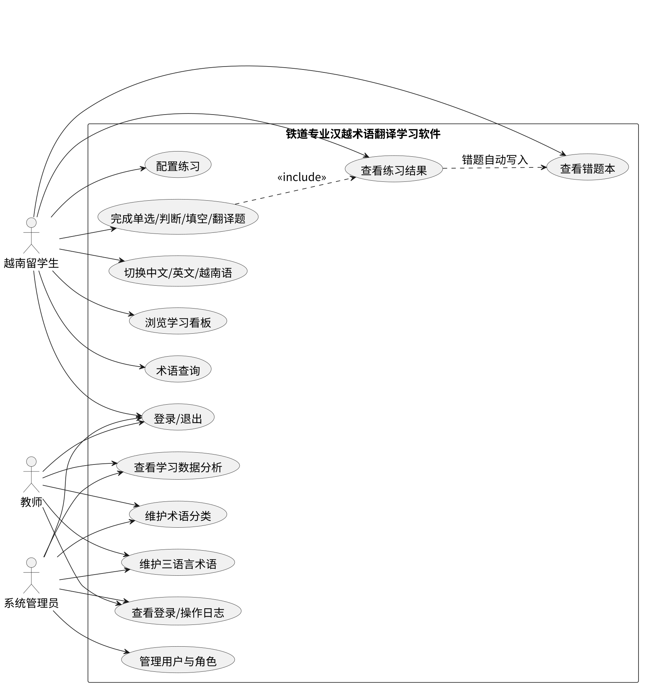<figcaption>图1 系统用例图</figcaption></figure>

图1展示越南留学生、教师和系统管理员三类角色与系统功能之间的用例关系。越南留学生主要使用登录、三语言切换、学习看板、术语查询、练习、结果查看和错题本；教师主要承担术语分类维护、三语言术语维护、学习数据查看和日志查看；管理员在教师能力基础上增加用户与角色管理。该图放在需求分析章节，用于明确系统边界、用户角色、功能归属和后续详细设计所依据的权限分工。

## 三、系统概述

### 3.1 总体说明

系统由 H5 前端、Node.js 后端服务和 MySQL 数据库组成。前端负责页面展示、三语言切换、表单交互、练习答题和数据展示；后端负责认证鉴权、业务接口、练习判分、分页查询和数据持久化；数据库负责存储用户、角色、术语、分类、练习记录、答题明细、错题、收藏和日志数据。

### 3.2 功能模块结构

| 模块 | 服务角色 | 主要页面 | 主要数据对象 |
|---|---|---|---|
| 登录认证 | 学生、教师、管理员 | 登录页 | sys_user、sys_role、sys_login_log |
| 术语管理 | 教师、管理员 | 术语列表、新增弹窗、编辑弹窗 | term_category、railway_term |
| 练习平台 | 学生 | 练习配置、答题页、结果页 | railway_term、practice_record、practice_answer |
| 错题本 | 学生 | 数据分析与错题本 | wrong_question、railway_term |
| 数据分析 | 学生、教师、管理员 | 学习看板、数据分析页 | practice_record、practice_answer、wrong_question |
| 系统管理 | 教师、管理员 | 用户列表、角色、日志 | sys_user、sys_role、sys_login_log、sys_operation_log |

<figure class="diagram">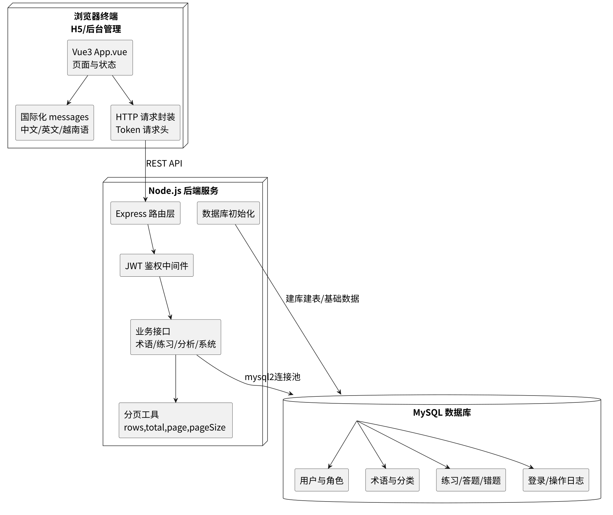<figcaption>图2 系统架构图</figcaption></figure>

图2展示系统由浏览器终端、Node.js 后端服务和 MySQL 数据库组成的总体架构。前端包含 Vue 页面、国际化资源和 HTTP 请求封装；后端包含 Express 路由、JWT 鉴权、业务接口、分页工具和数据库初始化；数据库负责保存用户角色、术语分类、练习答题、错题和日志数据。该图放在系统概述章节，用于从整体上说明前端、后端、数据库之间的职责边界和调用链路。

## 四、总体设计

### 4.1 技术架构

系统采用浏览器/服务器架构。前端使用 Vue3 和 Vite 构建 H5 响应式页面；后端使用 Express 提供 REST API；数据库使用 MySQL，字符集采用 utf8mb4 以支持中文、英文和越南语字符。前端通过 HTTP 请求访问后端接口，后端通过连接池访问数据库。部署时数据库地址、端口、账号、密码等敏感配置通过环境变量提供，文档中统一脱敏为 `***`。

### 4.2 前后端交互

用户登录后，后端返回访问凭证，前端将其保存到本地存储并在后续请求中放入请求头。术语管理、练习、分析和系统管理接口均通过鉴权中间件识别用户身份。教师和管理员可访问管理功能，学生主要访问学习与练习功能。

### 4.3 分页设计

术语、分类、用户、角色、登录日志、操作日志、练习记录和错题列表均支持分页查询。分页接口统一接收 `page` 和 `pageSize` 参数，返回 `rows`、`total`、`page`、`pageSize` 四个字段。前端根据总数计算页数，并展示上一页、下一页和总记录数。

<figure class="diagram">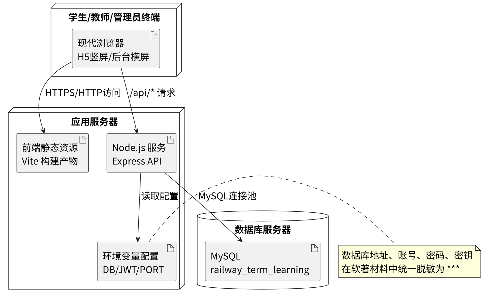<figcaption>图3 系统部署图</figcaption></figure>

图3展示系统在运行环境中的部署关系。学生、教师和管理员通过浏览器访问 H5 学习页面和后台管理页面；应用服务器承载前端静态资源和 Node.js API 服务；后端通过环境变量读取服务端口、数据库和鉴权配置，并通过连接池访问 MySQL 数据库。该图放在总体设计章节，用于说明系统在本地教学服务器、机房服务器或普通 Web 服务器上的部署方式，图中涉及的地址、账号、密钥等均按软著材料要求脱敏。

## 五、详细设计

### 5.1 登录与角色权限设计

登录页面支持账号密码输入和三语言切换。后端校验用户状态和密码，校验成功后签发访问凭证。用户角色分为管理员、教师和学生。管理员拥有用户管理、术语管理、系统日志和数据分析能力；教师拥有术语维护、学习数据查看和日志查看能力；学生拥有术语学习、练习和个人分析能力。

### 5.2 术语管理设计

术语管理台采用横屏表格布局，主要字段包括中文术语、越南语翻译、英文翻译、分类、难度和操作。管理人员可通过关键词查询定位术语，也可按分类、难度筛选数据。新增和编辑采用弹窗形式，减少页面跳转，保证管理人员在当前列表上下文中完成录入和维护。

### 5.3 练习平台设计

练习平台允许学生选择题型、分类、难度和题目数量。系统从启用状态的术语中筛选数据并随机生成题目。单选题用于识别中文术语对应的越南语翻译；判断题用于判断术语翻译是否匹配；填空题用于输入越南语翻译；翻译题用于将越南语术语翻译为中文术语。提交后系统比较用户答案与正确答案，生成练习记录和答题明细，错误项写入错题表。

<figure class="diagram">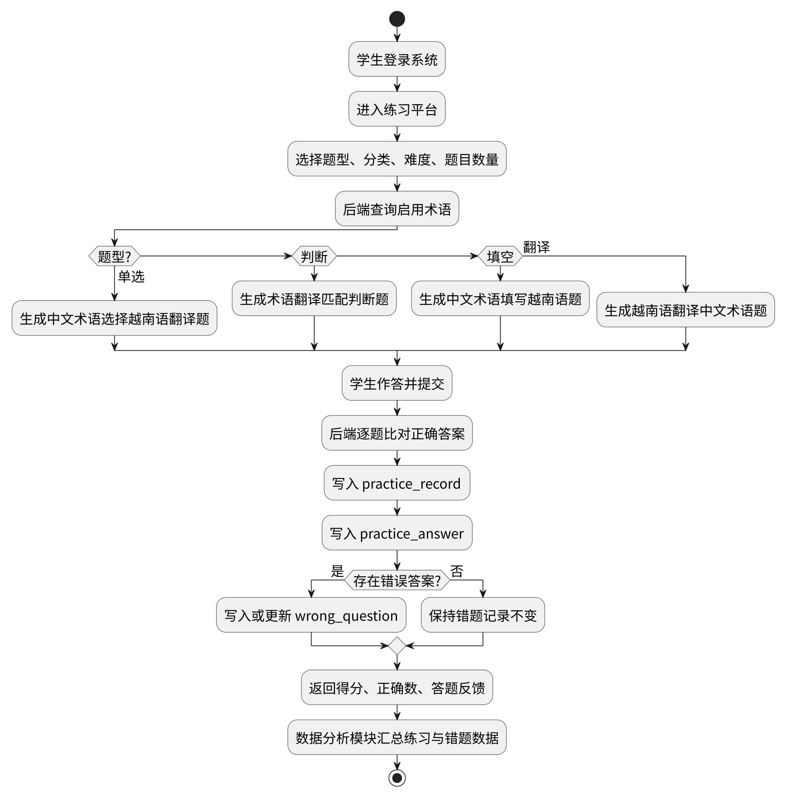<figcaption>图4 练习业务流程图</figcaption></figure>

图4展示学生练习业务的完整处理流程。学生登录后进入练习平台，选择题型、分类、难度和题目数量；后端根据条件查询启用术语并生成单选、判断、填空或翻译题；学生提交答案后，后端逐题比对正确答案，写入练习记录和答题明细，错误项进入错题表；最终结果返回前端并供数据分析模块汇总。该图放在详细设计章节，用于说明练习平台如何把术语库、答题过程、错题本和学习分析连接为闭环。

### 5.4 数据分析设计

学生端分析以个人学习结果为核心，统计练习次数、答题数量、正确数量、平均分、正确率、趋势和错题列表。管理端分析以整体运营数据为核心，统计用户总数、术语总数、练习总次数、平均得分、高频错误术语和分类术语数量。

### 5.5 系统管理设计

系统管理模块展示用户列表、角色信息和登录日志。用户列表用于查看账号、姓名、角色和状态；角色信息用于区分系统权限；登录日志用于审计用户访问情况。列表采用分页方式展示，避免日志和用户数量增加后影响页面性能。

## 六、数据设计

### 6.1 数据表总览

| 表名 | 中文名称 | 用途 |
|---|---|---|
| sys_user | 用户表 | 存储账号、密码摘要、姓名、邮箱、角色和状态 |
| sys_role | 角色表 | 存储管理员、教师、学生及扩展角色 |
| sys_login_log | 登录日志表 | 记录登录账号、IP、浏览器、结果和时间 |
| sys_operation_log | 操作日志表 | 记录业务模块操作行为 |
| term_category | 术语分类表 | 存储铁道专业分类的三语言名称 |
| railway_term | 铁道术语表 | 存储三语言术语、释义、例句、分类和难度 |
| practice_record | 练习记录表 | 存储一次练习的题型、数量、正确数和得分 |
| practice_answer | 答题明细表 | 存储每道题的用户答案、正确答案和判分结果 |
| wrong_question | 错题表 | 存储学生答错的术语及错误次数 |
| favorite_term | 收藏术语表 | 存储学生收藏的术语 |

### 6.2 核心字段说明

| 表名 | 字段名 | 中文名称 | 类型 | 约束/默认值 | 用途说明 |
|---|---|---|---|---|---|
| sys_user | username | 用户名 | VARCHAR | 唯一 | 登录账号 |
| sys_user | password_hash | 密码摘要 | VARCHAR | 非空 | 存储加密后的密码 |
| sys_user | role_id | 角色编号 | INT | 外键 | 关联角色表 |
| term_category | name_zh | 中文分类名 | VARCHAR | 非空 | 显示中文分类 |
| term_category | name_en | 英文分类名 | VARCHAR | 非空 | 显示英文分类 |
| term_category | name_vi | 越南语分类名 | VARCHAR | 非空 | 显示越南语分类 |
| railway_term | term_zh | 中文术语 | VARCHAR | 非空 | 中文铁道专业术语 |
| railway_term | term_en | 英文术语 | VARCHAR | 非空 | 英文翻译 |
| railway_term | term_vi | 越南语术语 | VARCHAR | 非空 | 越南语翻译 |
| railway_term | difficulty | 难度 | ENUM | easy/medium/hard | 练习筛选和学习分层 |
| practice_record | score | 得分 | DECIMAL | 自动计算 | 保存练习结果 |
| practice_answer | is_correct | 是否正确 | TINYINT | 0/1 | 判断答题结果 |
| wrong_question | wrong_count | 错误次数 | INT | 默认 1 | 统计错题频次 |

<figure class="diagram">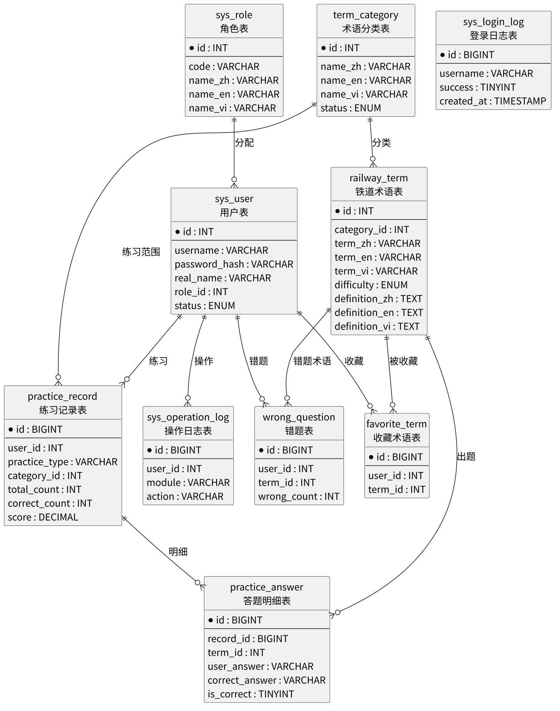<figcaption>图5 数据库 ER 图</figcaption></figure>

图5展示系统核心数据对象之间的关系。角色分配给用户，术语分类包含铁道术语，学生练习生成练习记录和答题明细，答题明细关联具体术语，错误答案进入错题表，收藏表记录学生关注的术语，登录日志和操作日志用于审计。该图放在数据设计章节，用于说明数据库表之间的主从关系、业务流转关系和数据分析来源，是后续接口设计和功能验证的重要依据。

## 七、接口设计

### 7.1 认证接口

| 方法 | 接口 | 功能 |
|---|---|---|
| POST | /api/auth/login | 用户登录 |
| GET | /api/auth/profile | 获取当前用户信息 |
| PUT | /api/auth/password | 修改密码 |
| POST | /api/auth/logout | 退出登录 |

### 7.2 术语与练习接口

| 方法 | 接口 | 功能 |
|---|---|---|
| GET | /api/terms | 分页查询术语 |
| POST | /api/terms | 新增术语 |
| PUT | /api/terms/:id | 编辑术语 |
| DELETE | /api/terms/:id | 删除术语 |
| GET | /api/terms/categories | 查询术语分类 |
| POST | /api/practice/start | 开始练习并生成题目 |
| POST | /api/practice/submit | 提交练习并判分 |
| GET | /api/practice/records | 分页查询练习记录 |
| GET | /api/practice/wrong-questions | 分页查询错题 |

### 7.3 分析与系统接口

| 方法 | 接口 | 功能 |
|---|---|---|
| GET | /api/analysis/student | 查询学生学习分析 |
| GET | /api/analysis/admin | 查询管理端分析 |
| GET | /api/system/users | 分页查询用户 |
| GET | /api/system/roles | 分页查询角色 |
| GET | /api/system/logs/login | 分页查询登录日志 |
| GET | /api/system/logs/operation | 分页查询操作日志 |

## 八、运行与部署设计

系统运行时需要 Node.js、浏览器和 MySQL 数据库。前端开发服务默认通过 Vite 启动，后端服务通过 Node.js 启动。数据库连接信息通过环境变量配置，文档中不记录真实密码、真实服务器地址或令牌。部署时应先启动数据库，再启动后端服务，最后启动或发布前端资源。后端服务启动时会检查数据库和数据表，确保核心表结构存在。

## 九、安全与权限设计

系统使用密码摘要存储用户密码，避免明文保存。登录成功后使用访问凭证标识用户身份，后端接口通过鉴权中间件保护。管理类接口限制管理员和教师访问，学生角色不能进入用户管理和术语维护操作。系统记录登录日志和操作日志，便于后续审计。涉及数据库地址、账号、密码和运行路径的信息均按软著材料要求脱敏。

## 十、测试与验证

### 10.1 数据规模验证

系统已为所有核心数据表准备不少于 100 条测试数据，包括用户、角色、登录日志、操作日志、术语分类、术语、练习记录、答题明细、错题和收藏术语。该数据规模用于验证分页、筛选、查询和统计功能在多记录场景下的表现。

### 10.2 功能验证

系统已验证登录、个人信息获取、术语分类新增编辑删除、术语新增编辑收藏删除、分页查询、练习出题、练习提交、自动判分、练习记录查询、错题查询、学生分析、管理端分析、用户列表、角色列表、登录日志和操作日志等功能。前端生产构建通过，浏览器页面加载和术语分页切换正常。

## 十一、运行截图

### 11.1 H5 端运行截图

<figure class="screenshot h5">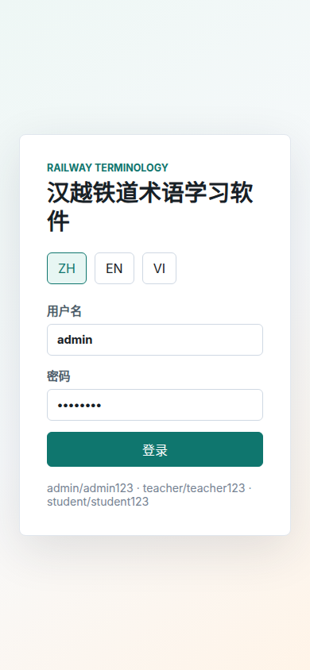<figcaption>图6 H5 登录页面</figcaption></figure>

图6展示系统 H5 端登录页面。页面包含软件名称、语言切换入口、用户名输入框、密码输入框和登录按钮，是越南留学生、教师与管理员进入系统的统一入口。该截图采用移动端视口截图，不使用长页面截图，能够保持真实 H5 竖屏比例，避免在 PDF 中被过度压缩。

<figure class="screenshot h5"><figcaption>图7 H5 中文学习看板</figcaption></figure>

图7展示中文界面的 H5 学习看板。页面显示术语总数、练习次数、平均得分、正确率、分类统计和最近术语信息，用于说明学生登录后查看个人学习概况的入口。该截图只保留当前视口内的核心区域，尺寸适合 A4 页面单图展示。

<figure class="screenshot h5">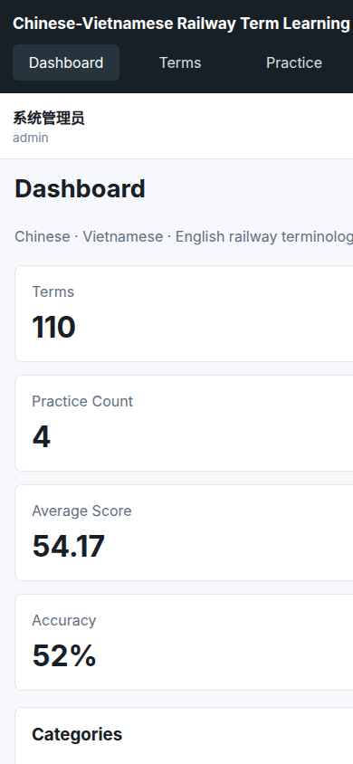<figcaption>图8 H5 英文学习看板</figcaption></figure>

图8展示英文界面的 H5 学习看板。系统通过顶部语言下拉框切换界面语言，导航、按钮和统计标题随前端国际化资源同步变化。该截图与中文、越南语截图分开单独成行展示，便于审阅人员清楚查看每一种语言状态。

<figure class="screenshot h5">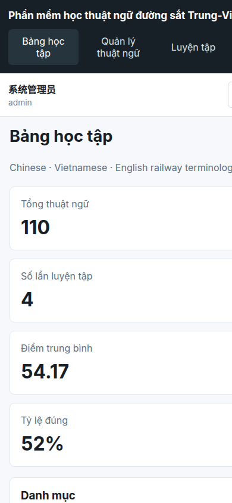<figcaption>图9 H5 越南语学习看板</figcaption></figure>

图9展示越南语界面的 H5 学习看板。该页面体现软件面向越南留学生的主要使用场景，学生可以在越南语界面中查看学习统计、进入术语管理和练习平台。截图为视口尺寸，单图独立排版，避免文字和图片互相挤压。

<figure class="screenshot h5">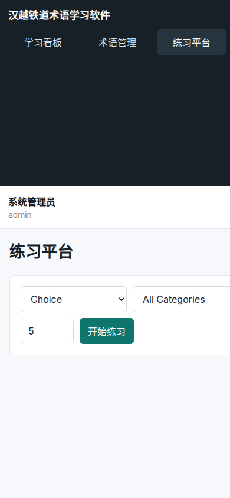<figcaption>图10 H5 练习配置</figcaption></figure>

图10展示 H5 练习配置页面。学生可选择题型、术语分类、难度和题目数量，然后点击开始练习。该页面连接术语库、练习出题、答题记录和错题分析，是学习流程的起点。单图排版能够完整保留控件位置和页面层级。

<figure class="screenshot h5">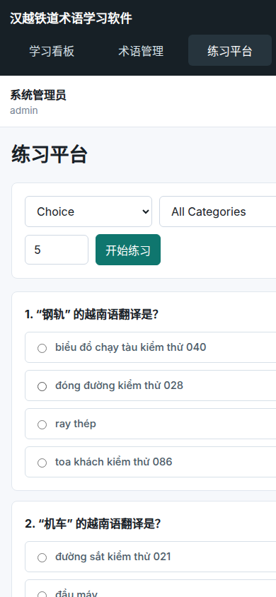<figcaption>图11 H5 单选题练习</figcaption></figure>

图11展示 H5 单选题练习页面。页面根据铁道专业术语库生成中文术语选择越南语翻译的题目，学生通过选择选项完成术语识别训练。截图只截取当前可视区域，题干和选项均保持清晰，适合放入软著说明书正文。

<figure class="screenshot h5">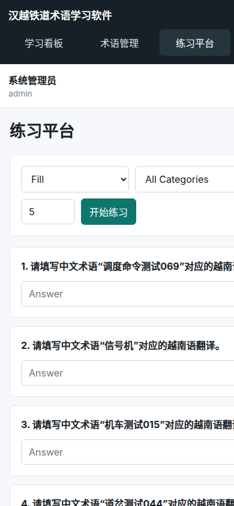<figcaption>图12 H5 填空题练习</figcaption></figure>

图12展示 H5 填空题练习页面。学生需要根据中文术语主动输入越南语翻译，系统提交后进入统一判分流程。该截图用于说明系统支持主观输入型训练，不仅限于选择题，能够更细致地检查术语记忆效果。

<figure class="screenshot h5">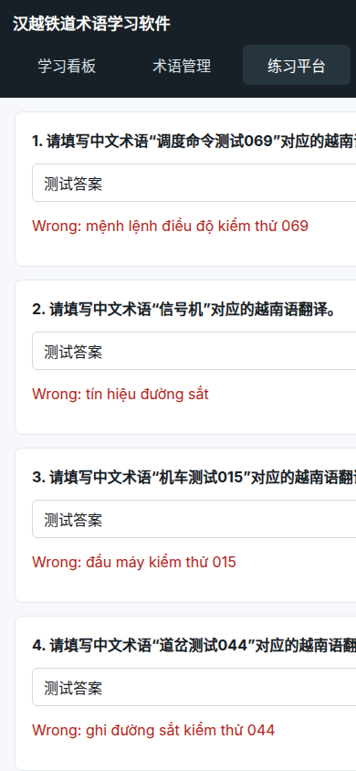<figcaption>图13 H5 练习结果</figcaption></figure>

图13展示 H5 练习结果页面。系统在学生提交答案后显示得分、正确数、总题数以及每题反馈，错误答案会进入错题记录。该截图用于说明练习模块具备自动判分、结果反馈和错题沉淀能力。

<figure class="screenshot h5">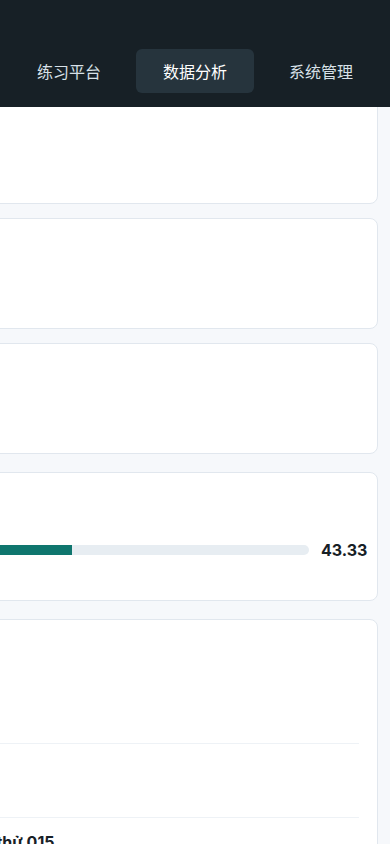<figcaption>图14 H5 数据分析与错题本</figcaption></figure>

图14展示 H5 数据分析与错题本页面。页面包含练习次数、平均得分、正确率、趋势数据和错题术语列表，帮助学生掌握学习进度和薄弱术语。该截图采用适合 A4 页面展示的移动端视口尺寸，不再使用超长全页截图。

### 11.2 后台管理端运行截图

<figure class="screenshot admin">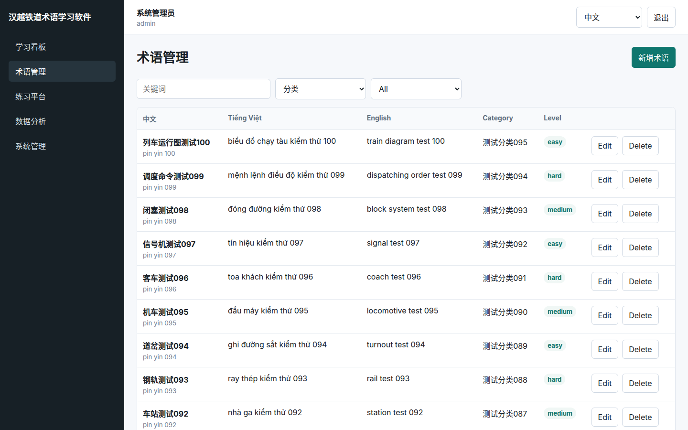<figcaption>图15 后台术语管理列表</figcaption></figure>

图15展示后台术语管理列表。页面以横向全屏方式呈现中文术语、越南语翻译、英文翻译、分类、难度和操作按钮，适合教师与管理员维护铁道专业术语库。后台截图采用 1440×900 视口，单张全宽展示，保证表格字段清晰。

<figure class="screenshot admin">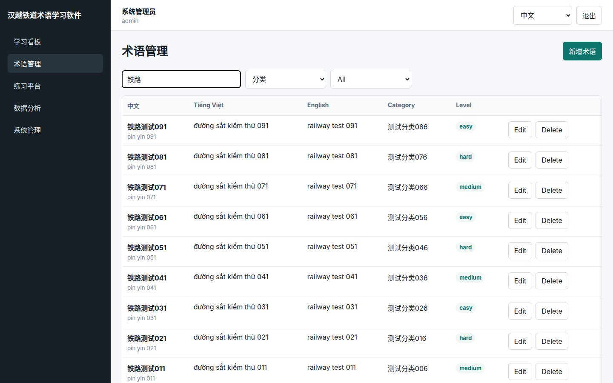<figcaption>图16 后台术语关键词查询</figcaption></figure>

图16展示后台术语关键词查询状态。管理人员输入关键词后，系统按中文、英文、越南语和拼音字段过滤术语列表。该截图用于说明后台管理台支持快速检索，适合在百条以上术语数据中定位需要维护的专业词条。

<figure class="screenshot admin">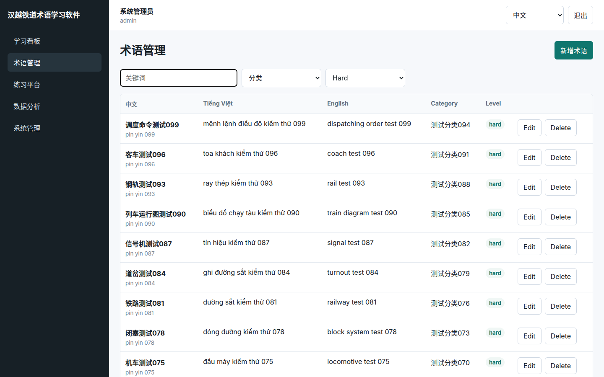<figcaption>图17 后台术语条件筛选</figcaption></figure>

图17展示后台术语条件筛选状态。页面通过分类和难度筛选术语数据，便于教师按教学阶段和专业方向组织内容。该截图保留完整横屏管理界面，字段、按钮和筛选条件均清晰可读。

<figure class="screenshot admin">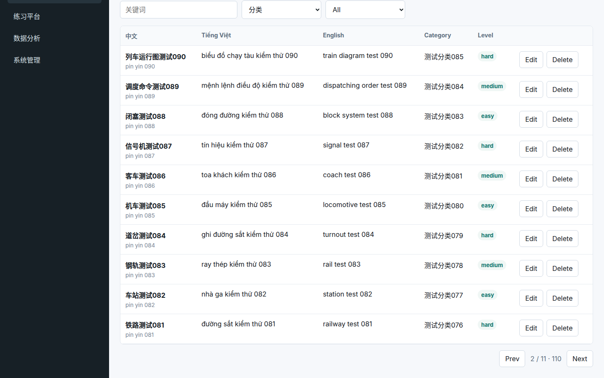<figcaption>图18 后台术语分页查询</figcaption></figure>

图18展示后台术语分页查询。页面显示当前页、总页数、总记录数以及上一页、下一页按钮，说明系统在百条以上数据场景下通过分页接口提高查询和渲染效率。该截图为单图全宽排版，不会挤压正文。

<figure class="screenshot admin">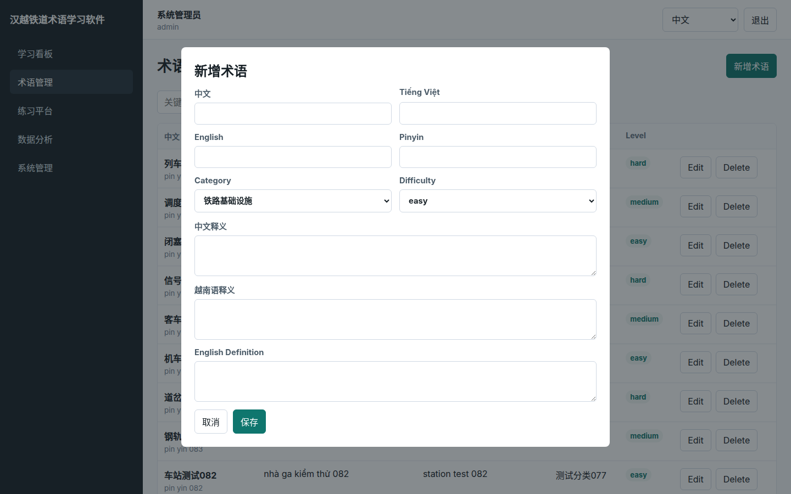<figcaption>图19 后台新增术语弹窗</figcaption></figure>

图19展示后台新增术语弹窗。弹窗包含中文、越南语、英文、拼音、分类、难度和多语言释义字段，教师可在当前列表上下文中录入新术语。该截图用于说明系统支持三语言术语结构化维护。

<figure class="screenshot admin">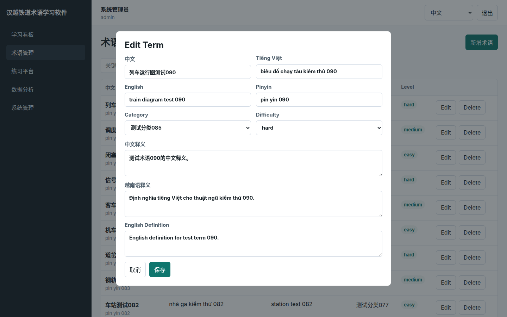<figcaption>图20 后台编辑术语弹窗</figcaption></figure>

图20展示后台编辑术语弹窗。系统将已有术语的多语言字段、分类和难度回填到表单中，管理人员可修正翻译、补充释义和调整难度。该截图说明术语内容可持续维护，后续练习和分析使用更新后的数据。

<figure class="screenshot admin">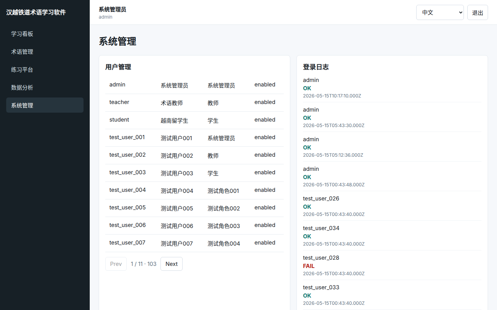<figcaption>图21 后台系统管理</figcaption></figure>

图21展示后台系统管理页面。页面包含用户列表、角色信息、登录日志和分页控件，用于说明系统公共管理模块的用户管理、角色区分和登录审计能力。该截图采用横向视口单图展示，能够清楚体现后台表格布局和分页控件。

## 十二、结论

面向越南留学生的铁道专业汉越术语翻译学习软件 V1.0 已形成包含登录认证、三语言界面、术语管理、练习平台、错题本、数据分析、系统管理和日志审计的完整功能体系。系统前端适配 H5 竖屏学习场景和后台横屏管理场景，后端提供统一鉴权、分页查询和业务接口，数据库支持多语言术语数据和练习过程数据的持久化。通过真实运行截图和功能验证可见，系统能够满足越南留学生铁道专业术语学习及教师管理维护的基本业务需求。

## 十三、附录：运行截图索引

| 序号 | 截图文件 | 页面类型 | 页面名称 | 说明 |
|---|---|---|---|---|
| 1 | 01_h5_login_view.png | H5视口 | 登录页面 | 展示统一登录入口、语言切换和账号密码输入区域 |
| 2 | 02_h5_dashboard_zh_view.png | H5视口 | 中文学习看板 | 展示中文界面的学习统计和导航入口 |
| 3 | 03_h5_dashboard_en_view.png | H5视口 | 英文学习看板 | 展示英文界面切换后的页面状态 |
| 4 | 04_h5_dashboard_vi_view.png | H5视口 | 越南语学习看板 | 展示越南语界面，体现越南留学生使用场景 |
| 5 | 05_h5_practice_config_view.png | H5视口 | 练习配置 | 展示题型、分类、难度和题目数量配置 |
| 6 | 06_h5_choice_practice_view.png | H5视口 | 单选题练习 | 展示中文术语选择越南语翻译的题目 |
| 7 | 07_h5_fill_practice_view.png | H5视口 | 填空题练习 | 展示主动输入越南语翻译的题目 |
| 8 | 08_h5_practice_result_view.png | H5视口 | 练习结果 | 展示自动判分结果和逐题反馈 |
| 9 | 09_h5_analysis_view.png | H5视口 | 数据分析与错题本 | 展示学习统计、趋势数据和错题列表 |
| 10 | 10_admin_terms_list_view.png | 后台横屏 | 术语管理列表 | 展示三语言术语、分类、难度和操作按钮 |
| 11 | 11_admin_terms_search_view.png | 后台横屏 | 术语关键词查询 | 展示按关键词过滤术语列表的结果 |
| 12 | 12_admin_terms_filter_view.png | 后台横屏 | 术语条件筛选 | 展示按难度条件筛选术语数据 |
| 13 | 13_admin_terms_pagination_view.png | 后台横屏 | 术语分页查询 | 展示分页按钮、页码和总记录数 |
| 14 | 14_admin_term_add_modal_view.png | 后台横屏 | 新增术语弹窗 | 展示新增术语的三语言表单字段 |
| 15 | 15_admin_term_edit_modal_view.png | 后台横屏 | 编辑术语弹窗 | 展示已存在术语的编辑维护状态 |
| 16 | 16_admin_system_management_view.png | 后台横屏 | 系统管理 | 展示用户、角色、登录日志和分页控件 |

上述截图均来自系统真实运行状态。H5 页面统一采用 390×844 移动端视口截图，后台管理页面统一采用 1440×900 横向视口截图。说明书正文仅放入尺寸合适的视口截图，不再使用超长全页截图；运行截图章节按单图独立成行和分页方式排版，避免图片缩放过小、正文被挤压或文字竖排变形。

## 十四、附录：功能与接口验证清单

| 验证项 | 覆盖模块 | 验证结果 |
|---|---|---|
| 用户登录 | 登录认证 | 管理员账号可登录，后端返回访问凭证并写入登录日志 |
| 当前用户信息 | 登录认证 | 登录后可通过接口获取当前用户身份、角色和状态 |
| 三语言切换 | 国际化 | 中文、英文、越南语界面均可切换并显示对应文案 |
| 术语列表分页 | 术语管理 | 术语接口返回 rows、total、page、pageSize，前端可翻页 |
| 术语关键词查询 | 术语管理 | 可按中文、英文、越南语和拼音字段过滤 |
| 术语条件筛选 | 术语管理 | 可按分类和难度缩小查询范围 |
| 新增术语 | 术语管理 | 可提交三语言术语字段并写入数据库 |
| 编辑术语 | 术语管理 | 可修改术语翻译、释义、分类和难度 |
| 删除术语 | 术语管理 | 管理角色可删除指定术语记录 |
| 单选题练习 | 练习平台 | 可生成中文术语选择越南语翻译的题目 |
| 判断题练习 | 练习平台 | 可生成术语翻译匹配判断题 |
| 填空题练习 | 练习平台 | 可生成输入越南语翻译的填空题 |
| 翻译题练习 | 练习平台 | 可生成越南语到中文术语的翻译题 |
| 练习提交判分 | 练习平台 | 提交后自动计算得分、正确数和错误项 |
| 错题记录 | 错题本 | 错误答题可进入错题表并累加错误次数 |
| 学生分析 | 数据分析 | 可统计个人练习次数、平均分、正确率和趋势 |
| 管理端分析 | 数据分析 | 可统计用户数、术语数、练习次数和高频错误术语 |
| 用户分页 | 系统管理 | 用户列表支持分页查询与页码展示 |
| 角色分页 | 系统管理 | 角色列表支持分页查询 |
| 登录日志分页 | 系统管理 | 登录日志支持分页查询和审计查看 |
| 操作日志分页 | 系统管理 | 操作日志支持分页查询 |

功能验证覆盖了系统的主要业务链路和公共支撑模块，重点检查了认证鉴权、三语言界面、术语维护、练习出题、答题判分、错题记录、数据分析和分页查询。测试数据中各核心表均不少于一百条记录，能够验证系统在较多数据场景下的查询、分页、统计和页面展示能力。验证结果表明，系统各核心模块能够按设计目标协同工作，并能够为越南留学生铁道专业术语学习提供完整的数据闭环。
